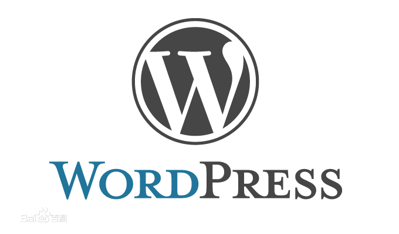

WordPress介绍
===

##简介
　　WordPress 是一个用 PHP 和 MySQL 开发的开源博客平台，可以在任何安装了 PHP 和 MySQL 的服务器上使用，并且最重要的一点是他是完全开放的自由软件（GNU软件），这也就意味着你可以随意的去改造他，并且不需要为之付出任何代价。在全世界前百名博客中有一半都在使用 WordPress，同时 WordPress 也是世界上使用人数最多的博客系统。由此可见 WordPress 的实用之处和强大影响力。

　　简单点说，WordPress 是一套在全世界都免费的建站系统，这套系统因易用性、易扩展性（插件、模板、二次开发）、功能强大、美观、搜索引擎友好等而全世界著名。其大量的插件系统足以使其变成论坛、门户等各种类型的网站，其中 WordPress 以建设个人博客型网站为特长 。（趣闻，南非政府花约 2300W 人民币向一个公司定制了一套政府网站系统，该系统却是用免费的 WordPress 和价值 320 元人民币的模板组成，贻笑大方）

　　截至2015-07-23，WordPress 最新版本为 4.2.3 ，运行环境要求：PHP 5.2.4 或更新版本；MySQL 5.0 或更新版本。

　　WordPress 中文：[http://cn.wordpress.org/](http://cn.wordpress.org/)

　　WordPress Codex：[http://codex.wordpress.org/](http://codex.wordpress.org/)

##优缺点
###优点
* 简单易用，可以让一个连基础 HTML 都不懂的人在短时间内建立一个自己的网站。  
* 有丰富的模板，插件。再也不怕自己的网站和别人的频繁撞衫了。
* 默认提供基础的文章发布，评论，RSS聚合等功能。
* 支持让主题直接重写WP的内核文件，增加了低成本自定义化的强度。
* 支持 Trackback 和 Pingback.
* 支持会员注册。
* 使用者较多，可以利用搜索引擎解决绝大多数平时遇到的问题。
###缺点
* 代码风格不是很好，PHP 和 HTML 嵌套使用。
* 数据库查询较为累赘。

## 正在使用 WordPress 的站点

　　1. 纽约时报博客

　　纽约时报是美国规模最大、最受人推崇的报纸，其网络博客质量较高并受到读者追捧，同时博客也与纽约时报的各方面得到极好地结合。技术、体育、政治等各领域的众多知名专栏作家、写手，知名人士，行业专家以及网络名人，在遵守由纽约时报规定的严格标准下，在博客上发表各自的看法。纽约时报拥有50多个WordPress博客。

　　2. Techcrunch

　　在Technorati的排行榜上，Techcrunch总排名第二，在信息技术类排名第一。Techcrunch的雏形是一个硅谷及其周边地区的博客介绍互联网公司，之后逐渐成长为一个技术型站点网络，提供各种内容与新型媒体。Techcrunch订阅人数超过400万，网络从美国延伸到欧洲、法国和日本，并且其crunch博客涉及技术范围内的所有领域——从移动设施到各种机械装置甚至社交媒体。

　　3. CNN博客

　　CNN是全球最大的新闻网络，依靠来自全世界各地通讯员与其他各种新闻来源，其下属博客随时提供新鲜及时、内容可靠、信息含量高的内容。CNN博客的内容涉及各种头条新闻和奇闻轶事，方便读者评论。

　　4. 连线杂志

　　作为美国长盛不衰的杂志的在线期刊，连线杂志报道各种技术问题与文化经济影响。在过去的时间里，连线杂志得以扬名并与时俱进，推出连线的iPad tablet程序，连续五天保持iTunes付费下载第一位的下载量。连线杂志的在线网站由WordPress驱动，其鲜艳的杂志类风格遵循了当下正流行的设计标准。

　　5. 路透社博客

　　似乎全球最大的新闻社都应该有自己的WordPress博客网络，路透社也有40多个WordPress站点，每一个都提供以时事政治为重点的分析与观点。

　　6. 华尔街日报博客

　　一直保持同样程式的新闻报道方式是华尔街日报大受欢迎的原因，其博客提供由特邀外场专家的全天候即时新闻报道和分析，日报员工会修改专家的即时报道让它们更清晰准确。

　　7. 中国数字时代

　　中国数字时代是一个致力于报道中国社会、政治与全球角色的协作性双语新闻站点，它集合了互联网上最新每分钟发布的关于中国的新闻，同时也允许独立报道与观点。

　　8. IBN Live

　　IBN Live是Global Broadcast News(GBN，全球广播新闻，印度一媒体公司)的在线网络，也是印度的24小时英文新闻平道，由Rajdeep Sardesai领头，作为CNN国际与GBN印度的合资。集合了这片次大陆所有角落的高质量新闻与相关的全球新闻，IBN Live的互动平台涵盖了各种多媒体内容，背后依靠的是1000多位新闻专业人员。

　　9.Cultura Digital

　　Cultura Digital是由巴西文化部运营的一家巴西社会网络，旨在通过整合公共民众、政府机构、国家企业、民间团体和市场的力量创造数字文化，提升社交媒体意识。Cultura充分利用WordPress社交网络插件BuddyPress，为爱好数字文化的巴西民众提供了一个高度互动的网站。

　　10. Thought Leader

　　Thought Leader是南非最受欢迎的WordPress网站，它综合了各种观点犀利的文章和发人深省的内容，从而引发的激烈的语言碰撞存在于新闻编辑室、公众甚至统治领域(?)。Thought Leader不仅是南非一些公认名人和贡献者的平台，也是新秀写手们的家园。
