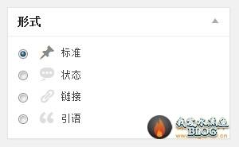
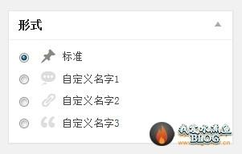

<!-- START doctoc generated TOC please keep comment here to allow auto update -->
<!-- DON'T EDIT THIS SECTION, INSTEAD RE-RUN doctoc TO UPDATE -->
**Table of Contents**  *generated with [DocToc](https://github.com/thlorenz/doctoc)*

- [Post Formats的使用](#post-formats%E7%9A%84%E4%BD%BF%E7%94%A8)
  - [Post Formats能用来干什么](#post-formats%E8%83%BD%E7%94%A8%E6%9D%A5%E5%B9%B2%E4%BB%80%E4%B9%88)
  - [如何使用Post Formats](#%E5%A6%82%E4%BD%95%E4%BD%BF%E7%94%A8post-formats)
    - [注册Post Formats](#%E6%B3%A8%E5%86%8Cpost-formats)
    - [使用Post Formats](#%E4%BD%BF%E7%94%A8post-formats)
  - [增强Post Formats](#%E5%A2%9E%E5%BC%BApost-formats)

<!-- END doctoc generated TOC please keep comment here to allow auto update -->

Post Formats的使用
===

Post Formats 是 wordpress 3.1 发布时添加的内容，如果你说你不知道是用来干什么的，那么你肯定见过这个区域。


##Post Formats能用来干什么

最简单最直观的，我们在发布文章的时候可以选择不同的文章形式，然后不同形式的文章以不同的形式展现出现。最典型的就是可以在博客中插入“说说”或者是“碎碎念”之类的东西。

##如何使用Post Formats

###注册Post Formats

在wordpress中内置了10种类型，并且默认是选择关闭的，你需要在functions.php里面添加这段代码，让他呈现在你的眼前.
```php
add_theme_support( 'post-formats', array('status','image','quote','video','audio') );
```
其十种形式分别是 aside audio chat gallery image link quote status video。

###使用Post Formats

```php
<?php 
 	if(has_post_format('status')):
  ?>
  <?php
  endif;
  >
```
简单的使用就是上面的代码段，不难看出核心就是has_post_format。

这样我们就可以简单的判断这个文章是什么类型，然后针对他采用不同的样式。

##增强Post Formats

wordpress官方并没有给出什么API可以让我们去创建新的Post Formats。唯一可以做的也许只有下面的方法：

```php
function rename_post_formats( $safe_text ) {
    if ( $safe_text == '状态' )
        return '自定义名字1';
    if ( $safe_text == '链接' )
        return '自定义名字2';
    if ( $safe_text == '引语' )
        return '自定义名字3';
    return $safe_text;
}
add_filter( 'esc_html', 'rename_post_formats' );
```



我们只是简单的修改了要呈现的文本，并没有修改任何的调用。虽然看着比较难看，但勉强能够完成我们所要的东西。