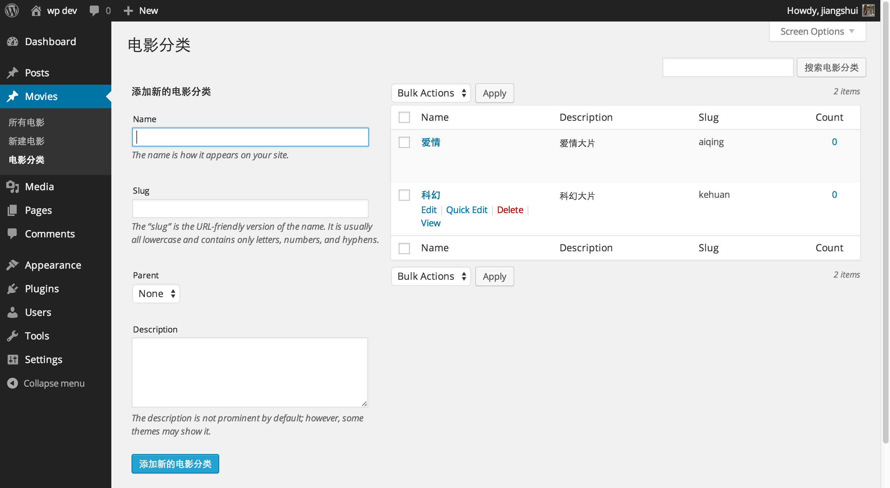
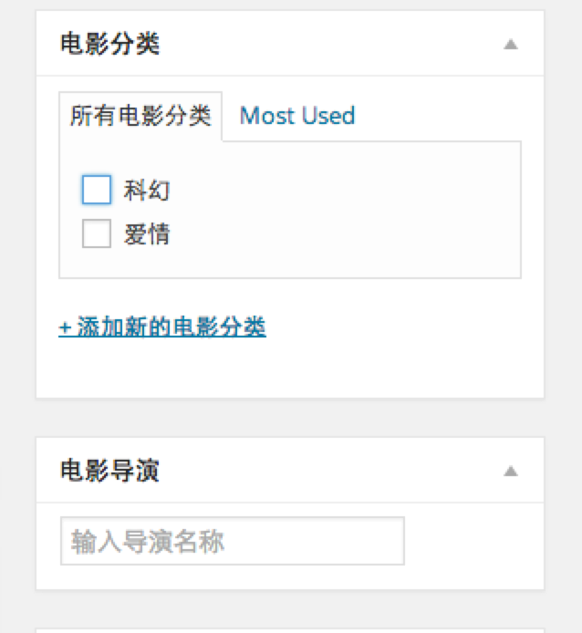
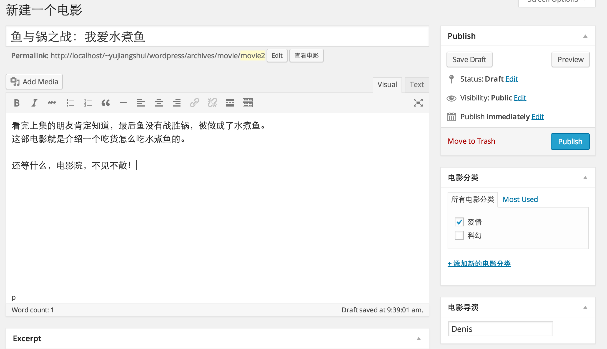
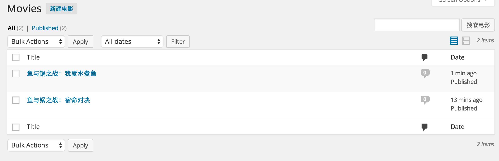
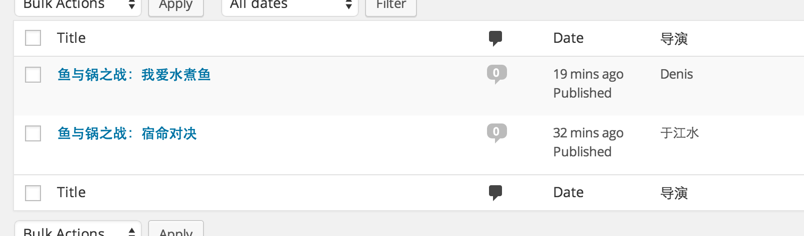

Custom Post Type的使用
===
##什么是Post Type
WordPress 里面内置了两种常用的 Post Type ：Post（文章）、Page（页面），分别用来展示两种类型的内容，一种是相对动态的文章，另一种是相对固定的页面。

除此之外，WordPress 还内置了其他几种 Post Type 用来展示不同类型的内容。但如果是一个比较复杂的网站或者需求自定义程度比较高，这时候就可以手动自己创建一个 Post Type 来展示某类信息。

比如大型杂志网站，可以为每个杂志类型创建不同的 Post Type 来进行管理；大型企业网站，可以为每个产品类型创建不同的 Post Type 来展示。

本节以创建一个 Movies Post Type 为例，介绍一系列与 Post Type 有关的事情。创建之后，我们可以新建 Movie 介绍，每一篇 Movie 可以自己添加 导演 等信息，还可以创建单独的电影列表等。

使用的主题是官方的 twentyfourteen，建议边看边在本地服务器修改测试。、

##创建一个Post Type
创建一个新的 Post Type 需要使用 register_post_type 函数来注册一下。需要在你主题的 functions.php 文件下调用该函数：
```
register_post_type( $post_type, $args );
```
$post_type 参数就是你自定义 Post Type 的名称，Post Type 可以自定义的功能非常多，所以这个函数里面的 $args 参数会很多,所以我们可以这样来注册post type:
```
function my_custom_post_product() {
    $args = array();
    register_post_type( 'product', $args ); 
}
add_action( 'init', 'my_custom_post_product' );
```
包裹在一个函数中，定义一个数组，然后挂靠到 init 这个 action 上。这样 WordPress 在初始化的时候，就会执行这个函数注册一个自定义 Post Type，因为调用 register_post_type() 的时候，必须要在** admin_menu action** 之前，在 after_setup_theme action 之后，所以这里最好挂靠到 init action 上(这里我们就用到了前面讲过的add_action这个钩子去增加新的功能)。

因此，在我们的这个例子中，这段代码大体上是这样写的：
```
function my_custom_post_movie() {
  $labels = array(
    'name'               => _x( 'Movies', 'post type 名称' ),
    'singular_name'      => _x( 'Movie', 'post type 单个 item 时的名称，因为英文有复数' ),
    'add_new'            => _x( '新建电影', '添加新内容的链接名称' ),
    'add_new_item'       => __( '新建一个电影' ),
    'edit_item'          => __( '编辑电影' ),
    'new_item'           => __( '新电影' ),
    'all_items'          => __( '所有电影' ),
    'view_item'          => __( '查看电影' ),
    'search_items'       => __( '搜索电影' ),
    'not_found'          => __( '没有找到有关电影' ),
    'not_found_in_trash' => __( '回收站里面没有相关电影' ),
    'parent_item_colon'  => '',
    'menu_name'          => 'Movies'
  );
  $args = array(
    'labels'        => $labels,
    'description'   => '我们网站的电影信息',
    'public'        => true,
    'menu_position' => 5,
    'supports'      => array( 'title', 'editor', 'thumbnail', 'excerpt', 'comments' ),
    'has_archive'   => true
  );
  register_post_type( 'movie', $args );
}
add_action( 'init', 'my_custom_post_movie' );
```
*在这段代码中，我们出现了很多的中文，虽然这种方法是没有太大的问题的，但是更加优雅的做法应该是写成英文，然后用相关的本地化函数翻译成中文。*

从上面代码可以看到 $args 数组里面有一个 labels 配置项，用来配置显示文案有关的内容，为了清晰所以单独拿出来创建了一个数组。其他配置项看下英文也能猜出大体意思，如果想要详细了解，可以看下官方文档：[register_post_type](http://codex.wordpress.org/Function_Reference/register_post_type) 。

将上面代码加到主题 functions.php 的最下面，进入后台你会发现多出了 Movies 选项，这样表示注册成功：


这时候我们可以新建 Movie 发表一篇电影类型的文章了。但是这样与文章类型基本相同，我们需要更多的自定义来完善我们的 Movie 类型。

##为Post Type添加分类功能

就电影来说，可以分为科幻、动作、战争等类别，那么我们就为自定义的 Movie 添加分类功能，这样就可以编辑新分类以及归类我们的电影了。这个分类跟文章里面的分类性质是一样的。

添加分类功能需要使用函数 [register_taxonomy](http://codex.wordpress.org/Function_Reference/register_taxonomy)，使用方法也很简单，跟注册 Post Type 函数类似，只不过多了一个参数用来指定对应的 Post Type ：
```
register_taxonomy( $taxonomy, $object_type, $args );

```
$taxonomy就是你自定的这个分类反而名称，$object_type就是这个分类所对应的Post Type名称，$args依然有很多的参数。

就本例而言，可以配置如下常用参数：
```
function my_taxonomies_movie() {
  $labels = array(
    'name'              => _x( '电影分类', 'taxonomy 名称' ),
    'singular_name'     => _x( '电影分类', 'taxonomy 单数名称' ),
    'search_items'      => __( '搜索电影分类' ),
    'all_items'         => __( '所有电影分类' ),
    'parent_item'       => __( '该电影分类的上级分类' ),
    'parent_item_colon' => __( '该电影分类的上级分类：' ),
    'edit_item'         => __( '编辑电影分类' ),
    'update_item'       => __( '更新电影分类' ),
    'add_new_item'      => __( '添加新的电影分类' ),
    'new_item_name'     => __( '新电影分类' ),
    'menu_name'         => __( '电影分类' ),
  );
  $args = array(
    'labels' => $labels,
    'hierarchical' => true,
  );
  register_taxonomy( 'movie_category', 'movie', $args );
}
add_action( 'init', 'my_taxonomies_movie', 0 );

```


为 Post Type 添加自定义 Meta Box
===
我们想要添加的电影类型不能仅仅只有正文内容，我们还需要额外添加一些 导演 之类的有关内容。那么就需要添加自定义 Meta Box，Meta Box 可以在文章发表页面中添加自定义的表单，编写文章的时候可以填写额外的信息然后在前端调用出来。

自定义 Meta Box 需要用到 [add_meta_box](http://codex.wordpress.org/Function_Reference/add_meta_box) 函数：
```
add_meta_box( $id, $title, $callback, $post_type, $context,$priority, $callback_args );
```
老规矩，具体参数内容查看官方文档，这里只介绍常用用法。我们注册一个 Meta Box ：
```
function movie_director() {
    add_meta_box(
        'movie_director',
        '电影导演',
        'movie_director_meta_box',
        'movie',
        'side',
        'low'
    );
}
add_action( 'add_meta_boxes', 'movie_director' );
```
然后在配置参数里面指定了回调函数 movie_director_meta_box(第三个参数)，我们需要在这个函数里面创建表单：

```
function movie_director_meta_box($post) {

    // 创建临时隐藏表单，为了安全
    wp_nonce_field( 'movie_director_meta_box', 'movie_director_meta_box_nonce' );
    // 获取之前存储的值
    $value = get_post_meta( $post->ID, '_movie_director', true );

    ?>

    <label for="movie_director"></label>
    <input type="text" id="movie_director" name="movie_director" value="<?php echo esc_attr( $value ); ?>" placeholder="输入导演名称" >

    <?php
}
```
这样就可以在文章界面边栏显示出来刚刚创建的表单了：



但是这时候，你的表单是没法用的，因为你提交文章之后并没有保存这个 Meta Box 的内容，下面是验证保存内容的代码：

```
function movie_director_save_meta_box($post_id){

    // 安全检查
    // 检查是否发送了一次性隐藏表单内容（判断是否为第三者模拟提交）
    if ( ! isset( $_POST['movie_director_meta_box_nonce'] ) ) {
        return;
    }
    // 判断隐藏表单的值与之前是否相同
    if ( ! wp_verify_nonce( $_POST['movie_director_meta_box_nonce'], 'movie_director_meta_box' ) ) {
        return;
    }
    // 判断该用户是否有权限
    if ( ! current_user_can( 'edit_post', $post_id ) ) {
        return;
    }

    // 判断 Meta Box 是否为空
    if ( ! isset( $_POST['movie_director'] ) ) {
        return;
    }

    $movie_director = sanitize_text_field( $_POST['movie_director'] );
    update_post_meta( $post_id, '_movie_director', $movie_director );

}
add_action( 'save_post', 'movie_director_save_meta_box' );
```
在这段函数中，我们更多的是需要注意安全的校验。把这些代码添加进 functions.php 文件之后，你的 Meta Box 就可以正常工作了。如果你需要更多表单，按照这个模式自定义表单结构，然后添加保存函数即可。

下面，我们迫不及待的添加两部电影《鱼与锅之战：宿命对决》 和 《鱼与锅之战：我爱水煮鱼》 内容如下：




添加完之后，我们可以看下所有电影：



列表空荡荡的，好难看，我可不可以加上导演字段？当然可以，使用 [manage $post type posts custom column](http://codex.wordpress.org/Plugin_API/Action_Reference/manage_$post_type_posts_custom_column) 即可实现，我们添加：

```
function movie_custom_columns($column){
    global $post;
    switch ($column) {
        case "movie_director":
            echo get_post_meta( $post->ID, '_movie_director', true );
            break;
    }
}
function movie_edit_columns($columns){

    $columns['movie_director'] = '导演';

    return $columns;
}

add_action("manage_posts_custom_column",  "movie_custom_columns");
add_filter("manage_edit-movie_columns", "movie_edit_columns");
```
即添加了列导演字段，并从每篇文章中读取出来。这样我们的列表就变成了：



OK，我们的后端部分就这样愉快的完成了。打开生成好的链接看下，咦，Not Found？是这样的，如果你的网站设置了固定连接，当你新建了 Post Type 之后，你必须要在后台更新一下固定连接设置才行。找到后台固定连接，再点击一下下面的“保存设置”，之后就可以正常访问了。

##展示Post Type的内容

单纯创建 Post Type 只是可以让你输入内容，没有什么意义，我们还需要在前台输出自定义 Post Type 的内容。

##自定义 Post Type 的模板和样式

根据 WordPress 的模板调用规则 我们可以得知，我们只需要创建 archive-[post_type].php 和 single-[post_type].php 就可以实现该 Post Type 的列表自定义和文章自定义。当访问 Post Type，WordPress 会优先调用这些模板来渲染。

需要注意的是，你需要在注册 Post Type 的时候设置 'has_archive' => true 才会有列表。

现在我们就把主题里自带的 archive.php 和 single.php 文件复制一份命名为 archive-movie.php 和 single-movie.php，为了演示，这里我不做很多自定义，只是输出导演信息表示一下。

我们分别在 L.56 和 L.23 附近的合适位置输出 Meta Box 信息：

```
echo '导演：'.get_post_meta( get_the_ID(), '_movie_director', true );
```

然后刷新访问电影列表和具体的电影就可以看到输出的导演信息了。

##调用 WP_Query 高度自定义调用 Post Type 的内容

上面操作依赖模板，如果需要高度自定义或者在页面的某个模块中调用列表，就需要用到 WP_Query 类来调用：

```
$args = array( 'post_type' => 'movie', 'posts_per_page' => 10 );
$loop = new WP_Query( $args );
while ( $loop->have_posts() ) : $loop->the_post();
  the_title();
  echo '<div class="entry-content">';
  the_content();
  echo '</div>';
endwhile;
```
查询出来之后就跟常规的主循环一样了，自定输出结构即可。


这里只是举个例子，实际中往往会自定义结构和输出的信息格式等，这里不再进一步修改。这里不再麻烦演示了。

##在首页列表中显示自定义 Post Type 的内容

虽然我们自定义好了 Post Type 同时也编写了一些内容，但是在首页的列表里面并没有显示出来。自定义的 Post Type 的内容不会自动混入主循环里面。那如何让自定义 Post Type 的内容显示出来？

你需要使用 [pre_get_posts](http://codex.wordpress.org/Plugin_API/Action_Reference/pre_get_posts) 这个 action 来做一些处理：

```
function add_my_post_types_to_query( $query ) {
  if ( is_home() && $query->is_main_query() )
    $query->set( 'post_type', array( 'post', 'page', 'movie' ) );
  return $query;
}
add_action( 'pre_get_posts', 'add_my_post_types_to_query' );
```

在上面的 $query 变量里面设置的 post_type 数组就是要在主循环里面展示的内容，将你的自定义 Post Type 填写进去就可以在首页中显示出来了。

##设置自定义 Post Type 的固定连接

创建一个新的 Post Type 有时候也是为了更方便做 SEO，所以设置它的固定连接也非常重要。这里主要用到注册 Post Type 的参数数组里面的 rewrite 参数，常用以下几两项：

```slug =>自定义固定连接结构别名``` 默认是使用 Post Type 名（例如本例的 movie），可以被翻译。一般来说 Post Type 名可能与实际需要的 URL 不一样（ Post Type 为 movie，但 URL 可能需要 movies），就可使用该项自定义。

```with_front =>```  固定连接是否以根目录为基础路径。如果你在固定连接设置页面设置你的结构为 /archives/，那么你的 Post Type 生成的连接默认为 /archives/movie 如果设置该项为 false 即可去掉前面的 /archives/ 直接基于根路径生成固定连接。

大功告成，但这只是 Post Type 最基础的用法，Post Type 还有其他更高级的用法，更详细的参数配置还需要你去进一步挖掘来适应你网站的功能需求。

**本文作者[于江水](http://yujiangshui.com)，部分内容有修改。**

