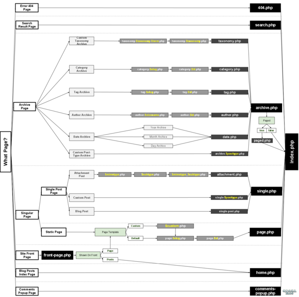

<!-- START doctoc generated TOC please keep comment here to allow auto update -->
<!-- DON'T EDIT THIS SECTION, INSTEAD RE-RUN doctoc TO UPDATE -->
**Table of Contents**  *generated with [DocToc](https://github.com/thlorenz/doctoc)*

- [WordPress模板层次介绍](#wordpress%E6%A8%A1%E6%9D%BF%E5%B1%82%E6%AC%A1%E4%BB%8B%E7%BB%8D)
  - [万能的index.php](#%E4%B8%87%E8%83%BD%E7%9A%84indexphp)
  - [模板层次图](#%E6%A8%A1%E6%9D%BF%E5%B1%82%E6%AC%A1%E5%9B%BE)
  - [模板加载顺序](#%E6%A8%A1%E6%9D%BF%E5%8A%A0%E8%BD%BD%E9%A1%BA%E5%BA%8F)
    - [首页](#%E9%A6%96%E9%A1%B5)
    - [文章页](#%E6%96%87%E7%AB%A0%E9%A1%B5)
    - [页面](#%E9%A1%B5%E9%9D%A2)
    - [分类页](#%E5%88%86%E7%B1%BB%E9%A1%B5)
    - [标签页](#%E6%A0%87%E7%AD%BE%E9%A1%B5)
    - [自定义分类法](#%E8%87%AA%E5%AE%9A%E4%B9%89%E5%88%86%E7%B1%BB%E6%B3%95)
    - [自定义文章类型](#%E8%87%AA%E5%AE%9A%E4%B9%89%E6%96%87%E7%AB%A0%E7%B1%BB%E5%9E%8B)
    - [作者归档页](#%E4%BD%9C%E8%80%85%E5%BD%92%E6%A1%A3%E9%A1%B5)
    - [日期归档页](#%E6%97%A5%E6%9C%9F%E5%BD%92%E6%A1%A3%E9%A1%B5)
    - [搜索结果页](#%E6%90%9C%E7%B4%A2%E7%BB%93%E6%9E%9C%E9%A1%B5)
    - [附件页](#%E9%99%84%E4%BB%B6%E9%A1%B5)
  - [使用钩子修改模板](#%E4%BD%BF%E7%94%A8%E9%92%A9%E5%AD%90%E4%BF%AE%E6%94%B9%E6%A8%A1%E6%9D%BF)
  - [模板页面判断](#%E6%A8%A1%E6%9D%BF%E9%A1%B5%E9%9D%A2%E5%88%A4%E6%96%AD)

<!-- END doctoc generated TOC please keep comment here to allow auto update -->

WordPress模板层次介绍
===

WordPress模板的定义非常方便，但是在定制模板之前，我们有必要知道WordPress的模板层次，了解WordPress是如何加载模板文件的，这将有利于开发模板时合理利用资源及提高工作效率。

##万能的index.php

我们知道一个最简单的WordPress主题只需要 style.css 和 index.php 文件即可。这代表着 index.php 可以是任何一个页面的模板，无论是首页，还是文章页，或是分类页，再或者是搜索结果页面，它都能完美胜任。

也就是说，当对应的模板不存在时， index.php 将是WordPress最后的底牌。

##模板层次图



**下面内容最为直观的表述，建议收藏！**

##模板加载顺序

下面让我们来了解一下WordPress都是怎么加载模板的

###首页

1. 首先WordPress会先检查是否有静态首页，如果有静态首页，就会加载这个页面内容并通过 front-page.php 模板文件展示，如果没有这个模板文件，就会通过页面模板展示

2. 如果没有静态首页，就会加载 home.php  最新文章模板

3. 如果没有 home.php 则加载 index.php 模板

###文章页

1. 首先被考虑的是 single-{post_type}.php 这样一个模板文件（如文章类型是 product 那么对应的文件名就是 single-product.php ）

2. 如果找不到，那么就会加载 single.php 模板

3. 如果连 single.php 模板都没有则加载 index.php 模板。

###页面

1. 首先被考虑的是自定义模板，也就是编辑页面时所选择的模板

2. 如果没有自定义模板，则查找 page-{slug}.php 别名模板（如页面别名是 about 对应的文件名就是 page-about.php ）

3. 如果别名模板也没有就查找 page-{id}.php ID模板（如页面ID是 2 对应的文件名就是 page-2.php ）

4. 如果ID模板也没有那就是 page.php 模板了

5. 如果连 page.php 模板都没有则加载 index.php 模板

###分类页

1. 首先被考虑的是 category-{slug}.php 别名模板（如分类别名是 news 对应的文件名就是 category-news.php ）

2. 如果没有别名模板则查找 category-{id}.php ID模板（如分类ID是 1 对应的文件名就是 category-1.php ）

3. 如果ID模板也没有那就是 category.php 分类模板了

4. 如果 category.php 分类模板也没有则加载 archive.php 通用归档模板

5. 如果连 archive.php 通用归档模板都没有则加载 index.php 模板

###标签页

标签页模板加载顺序和分类页一样，只不过前缀不过 category 而是 tag （如 tag-{slug}.php）。

###自定义分类法

有时候除了WordPress默认的分类目录和标签我们还需要其他的分类方法，这时候我们就会注册一个新的分类法，那么在此之前知道分类法的模板加载顺序也是十分必要的。以下说明假设自定义分类法是 people 这个名字：

1. 分类法分类页首先被考虑的是 taxonomy-{taxonomy}-{term}.php 别名模板（如分类别名 teacher 对应的文件名就是 taxonomy-people-teacher.php ）

2. 如果没有别名模板，则加载该分类法归档页（如 taxonomy-people.php ）

3. 如果分类法归档页模板也没有则加载 archive.php 通用归档模板

4. 如果连 archive.php 通用归档模板都没有则加载 index.php 模板

###自定义文章类型

除了自定义分类法，有时候我们也需要自定义文章类型：

1. 自定义文章类型归档页首先被考虑的是 archive-{post_type}.php 别名模板（如文章类型是 product 那么对应的文件名就是 archive-product.php ）

2. 如果没有别名模板则加载 archive.php 通用归档模

3. 如果连 archive.php 通用归档模板都没有则加载 index.php 模板

###作者归档页

1. 首先被考虑的是 author-{nicename}.php 别名模板（如作者用户名是 steven 那么对应的文件名就是 author-steven.php ）

2. 如果没有别名模板则加载 author-{id}.php ID模板（如作者ID是 1 对应的文件名就是 author-1.php ）

3. 如果ID模板没有则加载 author.php 通用作者模板

4. 如果通用作者模板也没有则加载 archive.php 通用归档模板

5. 如果连 archive.php 通用归档模板都没有则加载 index.php 模板

###日期归档页

1. 首先被考虑的是 date.php 日期归档模板

2. 如果日期归档模板没有则加载 archive.php 通用归档模板

3. 如果连 archive.php 通用归档模板都没有则加载 index.php 模板

###搜索结果页

1. 首先被考虑的是 search.php 搜索结果模板

2. 如果没有搜索结果模板则加载 index.php 模板

###附件页

1. 首先会按MIME类型加载模板（如 image.php, video.php, application.php，而 text/plain 类型则按顺序尝试加载 text.php, plain.php, text_plain.php 这三个文件。

2. 如果没有对应的MIME类型模板则 attachment.php 附件模板（如没有 attachment.php 则加载 single-attachment.php ）

3. 如果没有附件模板则加载 single.php 文章页模板

4. 如果连 single.php 文章页模板都没有则加载 index.php 模板

##使用钩子修改模板

在某些使用场景（如插件），我们并不能直接修改模板文件，这时候我们可以使用钩子来实现修改模板文件，钩子名称是 {$type}_template 这样的格式，以下是对应的完整的钩子名称列表：

```

    index_template
    404_template
    archive_template
    author_template
    category_template
    tag_template
    taxonomy_template
    date_template
    home_template
    front_page_template
    page_template
    paged_template
    search_template
    single_template
    text_template, plain_template, text_plain_template (all mime types)
    attachment_template
    comments_popup
```

例如，让页面加载single.php的模板：

```php
function page_template_filter( $templates='' ){
$templates=locate_template("single.php",false);
return $templates;
}
add_filter( 'page_template', 'page_template_filter' );
```

##模板页面判断

一般情况下，在一个特定的模板中我们能清楚知道应该怎么输出特定的样式和内容，但在一些通用模板中（如 header.php ）我们想要知道用户当前访问的是哪个页面模板就需要借助WordPress内置的条件判断函数了，这些函数可以帮助我们判断当前是什么页面以方便加载不同的模板内容，如 is_home() 则是判断首页的条件标签，is_single() 则是判断文章页的条件标签，等等。


**本文作者：于江水**


